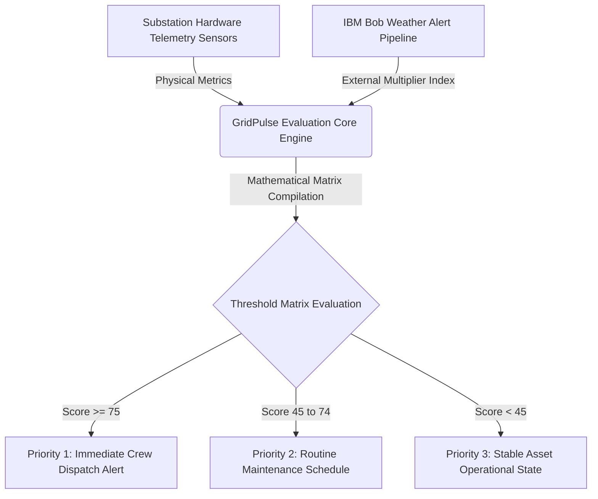

# Technical Architecture

## Data Flow & Processing Pipeline
GridPulse processes data through a deterministic pipeline that bridges physical substation sensors with external operational intelligence:

1. **Telemetry Ingestion Layer:** The system accepts multi-sensor physical metrics representing internal transformer conditions (Thermal, Chemical, and Kinetic stresses).
2. **Environmental Context Layer:** An external weather severity metric is introduced to account for active environmental threats (e.g., storms, high winds).
3. **Deterministic Evaluation Matrix:** Raw inputs are converted into normalized threshold scores based on high-voltage engineering limits.
4. **Weighted Consolidation Engine:** A priority matrix applies specific weights (40% Temperature, 40% Oil Degradation, 20% Vibration) to calculate a unified baseline risk profile.
5. **Dynamic Risk Escalation:** The environmental index acts as a multiplier on the baseline profile, escalating the urgency level if severe weather threatens an already stressed asset.
6. **Command Generation:** The final score determines the automated operational output, dispatching field crews or scheduling routine audits based on explicit hazard bands.

## System Components
The system components and data routing are mapped below:

## Component Matrix

| Technology | Role & Responsibility |
|---|---|
| **ANSI C Engine** | Houses the core computational logic, parsing numeric inputs and running the threshold algorithms with minimal computing overhead. |
| **IBM Bob Weather Pipeline** | Directs localized storm alerts and climate indexing parameters straight into the analytical application runtime. |
| **Mermaid Live Architecture** | Standardizes visual validation modeling for grid operators to track asset lifecycles across distribution points. |

## Security & Scalability Notes
- **Edge Deployment Ready:** Because the engine core is written in pure ANSI C without bloated external runtime dependencies, it can be compiled and flashed directly onto cheap edge microcontrollers inside active substations.
- **Fail-Safe Integrity:** The deterministic rule-based setup avoids the unpredictability of heavy AI model processing, ensuring that safety-critical infrastructure outputs remain perfectly stable, repeatable, and fast under pressure.
